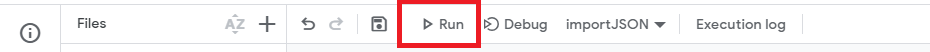

# import json data from api into google-sheet 


Open your Google Sheet.

Create a new <b>Google Sheet</b>

In the menu bar, click on <b>"Extensions"</b> and then select <b>"Apps Script."</b>


In the Apps Script editor, delete any code that might be there and replace it with the following code:


## google-sheet-snippets
```js
function importJSON() {
  // Replace 'YOUR_JSON_URL' with the URL of your JSON file
  var jsonUrl = 'YOUR_JSON_URL';
  
  // Fetch the JSON content
  var response = UrlFetchApp.fetch(jsonUrl);
  var jsonData = response.getContentText();
  
  // Parse the JSON data
  var data = JSON.parse(jsonData);
  
  // Get the active sheet
  var sheet = SpreadsheetApp.getActiveSpreadsheet().getActiveSheet();
  
  // Clear existing data in the sheet
  sheet.clear();
  
  // Write headers
  var headers = Object.keys(data[0]);
  sheet.appendRow(headers);
  
  // Write data to the sheet
  data.forEach(function(row) {
    var values = headers.map(function(header) {
      return row[header];
    });
    sheet.appendRow(values);
  });
}

``` 


Select File > Save

Name your code "ImportJSON"

Run the script by clicking on the play button (▶) in the toolbar.



This script fetches JSON data from the specified URL, parses it, and then writes it to the active sheet in your Google Spreadsheet.


## Author
Azhar Chaudhari
